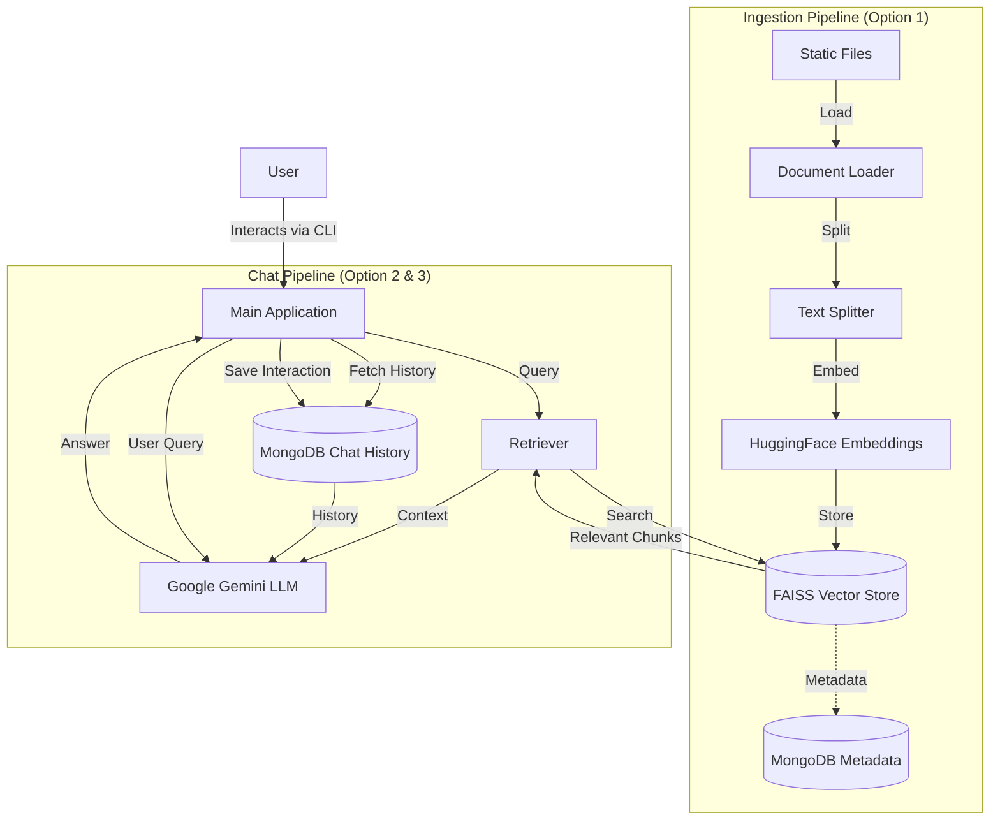

# LangChain QnA Bot (BuzzBot)

This project is a Retrieval-Augmented Generation (RAG) based Question & Answer bot built using **LangChain**, **Google Gemini**, and **MongoDB**. It enables users to ingest static documents (PDFs, Text, etc.), index them into a local FAISS vector store, and engage in conversational QnA with persistent history.

## 📋 Features

- **Document Ingestion**: Automatically processes documents from a source directory (PDF, TXT, DOCX, CSV).
- **Vector Search**: Utilizes **HuggingFace Embeddings** and **FAISS** for efficient semantic search.
- **Persistent Memory**: Stores chat history and session metadata in **MongoDB**, allowing users to resume past conversations.
- **LLM Integration**: Powered by **Google Gemini** (e.g., `gemini-2.5-flash`) for generating intelligent responses.
- **Session Management**: distinct sessions for different document sets or topics.

## 🏗️ Architecture

The system follows a standard RAG architecture with persistent storage for chat history.



## ⚙️ Configuration

The application requires a `.env` file with the following configuration keys:

```ini
# Database
mongo_url=mongodb://localhost:27017/
db_name=LangChainDatabase
collection_name=DocumentFolders
chat_collection_name=ChatHistory
session_meta_collection=SessionMetadata

# API Keys
google_api_key=YOUR_GOOGLE_API_KEY
serpapi_api_key=YOUR_SERPAPI_KEY

# Paths
source_directory=Static/
vector_store_root=VectorStores/

# Model Settings
llm_model=gemini-2.5-flash
llm_temperature=0.3
chunk_size=1000
chunk_overlap=100
retriever_k=5
```

## 🚀 Usage

1. **Install Dependencies**
   Ensure you have Python installed, then install the required packages:

   ```bash
   pip install langchain langchain-google-genai langchain-mongodb langchain-huggingface pymongo faiss-cpu python-dotenv
   ```

2. **Run the Application**
   Execute the main script:

   ```bash
   python BuzzBotUsingLangchain.py
   # OR
   python QnaUsingLangchain.py
   ```

3. **Menu Options**
   - **1. Process Static Folders**: Scans the `source_directory`, chunks documents, creates embeddings, and saves them to FAISS.
   - **2. Start New Chat**: Select a processed folder/knowledge base and start a new QnA session.
   - **3. Resume Previous Session**: View past sessions stored in MongoDB and continue the conversation.
   - **4. Quit**: Exit the application.

## 📂 Project Structure

- `BuzzBotUsingLangchain.py` / `QnaUsingLangchain.py`: Main application entry points.
- `Static/`: Directory for placing source documents.
- `VectorStores/`: Directory where FAISS indices are saved.
- `Archive/`: Contains previous iterations or backup scripts.
